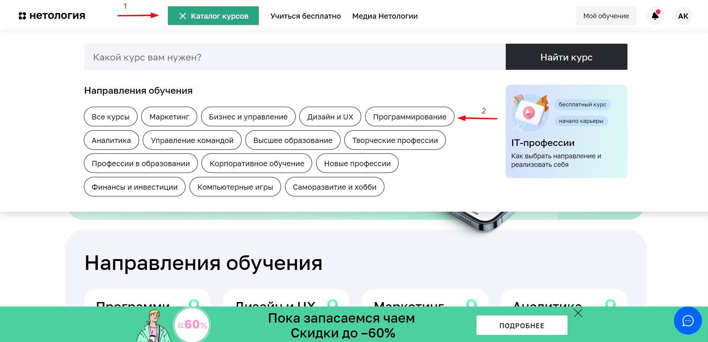
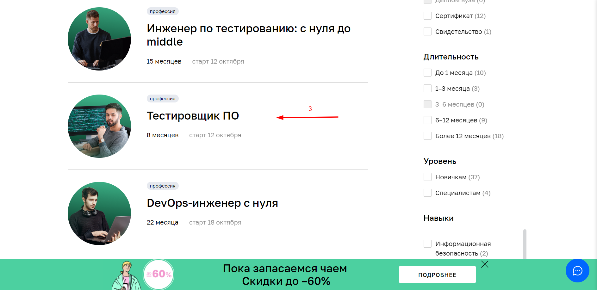
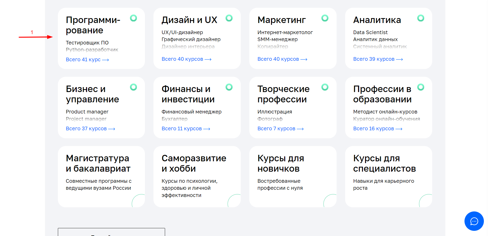
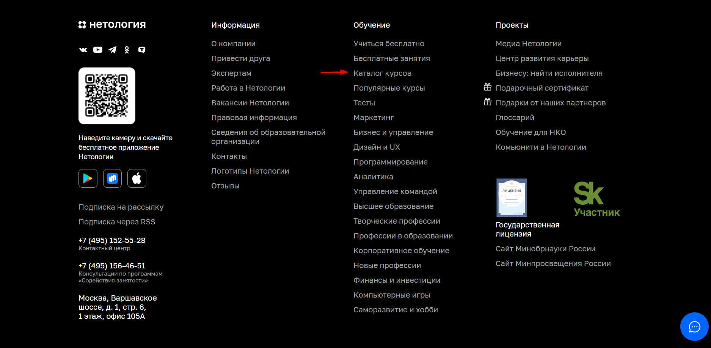
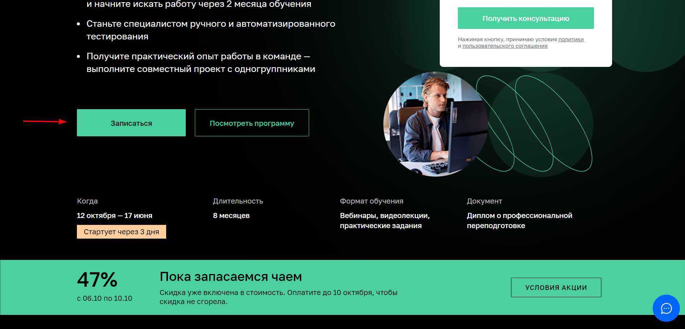
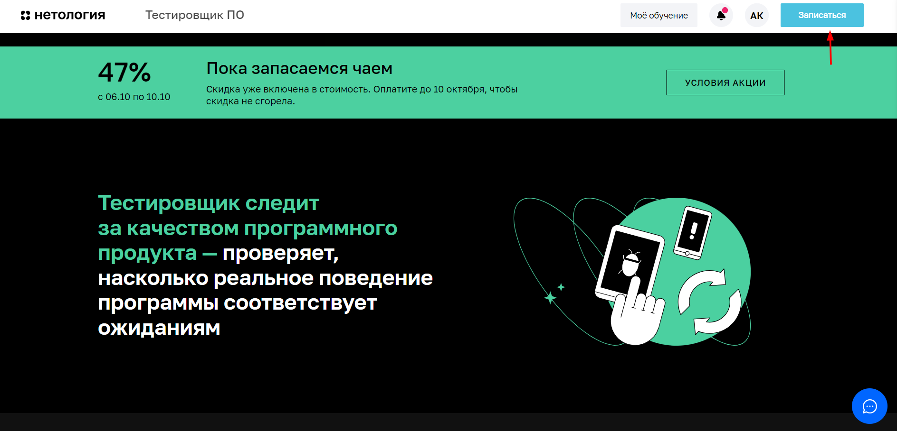

# Тестирование возможности записаться на обучение профессии «Тестировщик ПО»

1. Навигация с [главной страницы](https://netology.ru/) на [страницу формы](https://netology.ru/programs/qa) заявки на курс "Тестировщик" через [каталог курсов раздел "Программирование"](https://netology.ru/development) с проверкой фильтрации по курсам
	 
	 
2. Навигация с [главной страницы](https://netology.ru/) на страницу [каталога курсов раздела "Программирование"](https://netology.ru/development) через [раздел "Направления обучения"](https://netology.ru/#/directions) 
	 
 3. Навигация с фута [главной страницы](https://netology.ru/) на страницу ["Каталог курсов"](https://netology.ru/navigation)
	 
3. Навигация с футера [главной страницы](https://netology.ru/) на страницу ["Популярные курсы"](https://netology.ru/popular)
	
 4. Навигация с футера [главной страницы](https://netology.ru/) на страницу [каталога курсов раздела "Программирование"](https://netology.ru/development)
	 
 5. Навигация с [главной страницы](https://netology.ru/) на [страницу формы](https://netology.ru/programs/qa) заявки на курс "Тестировщик" через [рекламное предложение на главной](https://netology.ru/development) с проверкой фильтрации по курсам
	 
     
 6. Переход сверху [страницы курса "Тестировщик ПО"](https://netology.ru/programs/qa#/) к [форме записи](https://netology.ru/programs/qa#/order) на курс
	 
 7.  Проверка появление кнопки "Записаться" и перехода по ней с header [страницы курса "Тестировщик ПО"](https://netology.ru/programs/qa#/) к [форме записи](https://netology.ru/programs/qa#/order) на курс
	 

## Перечень автоматизируемых сценариев

**Сценарии тестирования UI:**

1. Успешная отправка валидно* заполненной [формы записи](https://netology.ru/programs/qa#/order) на курс "Тестировщик ПО", включая проверку ввода действующего промокода (с изменением стоимости курса) и перехода на страницы с условиями [политики](https://netology.ru/legal/11)  и  [пользовательского соглашения](https://netology.ru/legal/6)
2. Появление сообщения "Должно состоять из букв" у поля "Имя" при заполнение его спецсимволами в [форме записи](https://netology.ru/programs/qa#/order) на курс "Тестировщик ПО"
3. Появление сообщения "Должно состоять из букв" у поля "Имя" при заполнение его цифрами в [форме записи](https://netology.ru/programs/qa#/order) на курс "Тестировщик ПО"
4. Появление сообщения "Должно быть не короче 2 символов" у поля "Имя" при заполнение его одной буквой в [форме записи](https://netology.ru/programs/qa#/order) на курс "Тестировщик ПО"
5. Появление сообщения "Обязательное поле" у поля "Имя" при оставление поля пустым в [форме записи](https://netology.ru/programs/qa#/order) на курс "Тестировщик ПО"
6. Появление сообщения "Номер в формате +9 (999) 999-99-99" у поля "Телефон" при заполнение поля 8 цифрами в [форме записи](https://netology.ru/programs/qa#/order) на курс "Тестировщик ПО"
7. Появление сообщения "Номер в формате +9 (999) 999-99-99" у поля "Телефон" при заполнение поля 15 цифрами в [форме записи](https://netology.ru/programs/qa#/order) на курс "Тестировщик ПО"
8. Появление сообщения "Обязательное поле" у поля "Телефон" при оставление поля пустым в [форме записи](https://netology.ru/programs/qa#/order) на курс "Тестировщик ПО"
9. Появление сообщения "Устаревший промокод" у поля "Промокод" при вводе устаревшего валидного промокода в [форме записи](https://netology.ru/programs/qa#/order) на курс "Тестировщик ПО"
10.Появление сообщения "Промокод не существует" у поля "Промокод" при вводе не валидного промокода в [форме записи](https://netology.ru/programs/qa#/order) на курс "Тестировщик ПО" 

**Сценарии тестирования API:**

1. Проверка статуса 200 и совпадения валидных* данных отправленных через UI [формы записи](https://netology.ru/programs/qa#/order) на курс "Тестировщик ПО" с данными в body POST-запроса к серверу и новыми данными из БД. 
2. Проверка статуса 500 и отсутствие новых записей в БД при отправке пустого body в POST-запросе отправки [формы записи](https://netology.ru/programs/qa#/order) на курс "Тестировщик ПО"
3. Проверка статуса 500 и отсутствие новых записей в БД при отправке пустого значения у атрибута phone в body в POST-запросе отправки [формы записи](https://netology.ru/programs/qa#/order) на курс "Тестировщик ПО"
4. Проверка статуса 500 и отсутствие новых записей в БД при отправке пустого значения у атрибута name в body в POST-запросе отправки [формы записи](https://netology.ru/programs/qa#/order) на курс "Тестировщик ПО"

**Валидными значениями для полей являются::**

- обязательное поле "Имя": латиница, кириллица, пробел и дефис/тире, заполненный минимум двумя буквами
- обязательное поле "Телефон": цифры, круглые скобки, пробел и дефис/тире в формате +9 (999) 999-99-99, от 9 до 14 символов включительно
- не обязательное поле "Промокод": латиница, кириллица, цифры и спецсимволы, кроме пробела

## Перечень используемых инструментов с обоснованием выбора

 1. **IDE:** IntelliJ IDEA
 2. **Язык программирования:** Java
 3. **Система сборки:** Gradle (легче настраиваются зависимости)
 4. **Тестовая среда:** TestNG (имеет больше аннотаций для управления состоянием SUT, может разбивать тесты на наборы тестов, имеет больше возможностей по параметризации тестов)
 5. **Система репортинга:** Allure (понятная и популярная система репортинга)
 6. **Фреймворк для UI тестирования:** Selenide (популярный и простой инструмент)
 7. **Фреймворк для API тестирования:** REST Assured вместе с JSON Schema Validator (для отправки необходимых запросов и валидации JSON схем)
 8. **Фреймворки для управления данными:** Java Faker (для генерации данных), необходимый драйвер (в зависимости от диалекта) для подключения к БД и DBUtils (для чтения записей с БД)

## Перечень необходимых разрешений, данных и доступов

 1. Разрешение на проведение автотестирования.
 2. Доступ на чтение БД.
 3. Доступ к существующим тестовым данным.

## Перечень и описание возможных рисков при автоматизации

 1. Появление лишних записей в БД
 2. "Ложные" запросы к менеджерам на обратный звонок
 3. Дополнительная нагрузка на сервер 
 4. Потеря актуальности тестов при изменении пользовательского интерфейса сайта

## Перечень необходимых специалистов для автоматизации

С проектом справится junior QA инженер, который знаком с основами UI и API тестирования, а также владеет базовыми навыками написания автотестов с использованием шаблона Page Object.

## Интервальная оценка с учётом рисков в часах

После согласования всех необходимых соглашений и доступов, у специалиста написание тестов должно занять 15 - 30 часов.